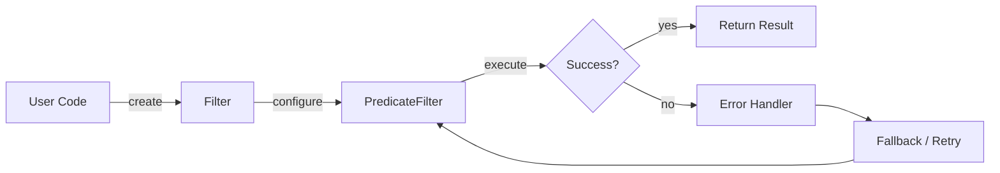
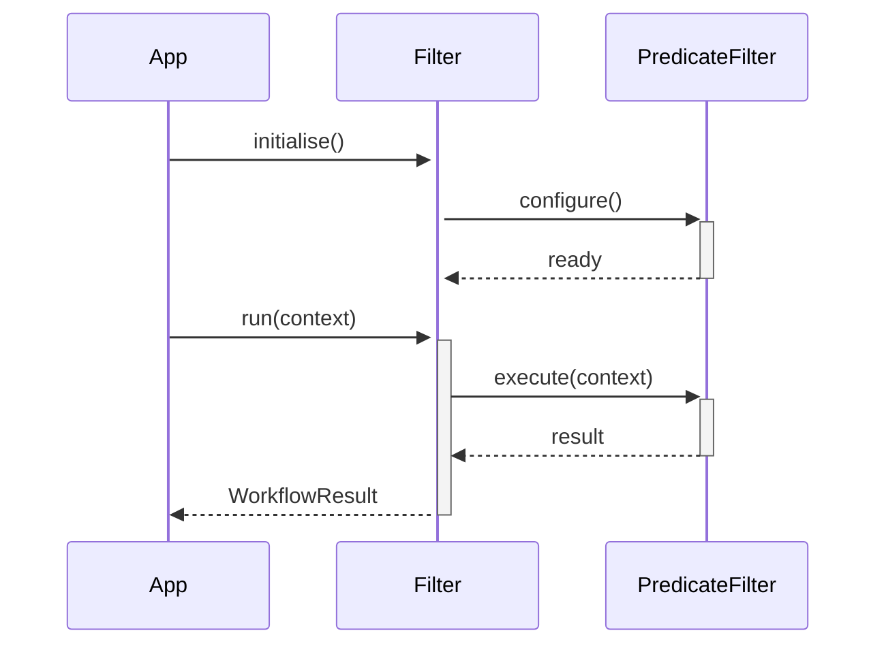

<div align="center">

</div>

# agent-filter

**Composable data filtering and transformation pipeline for agent outputs**

[](https://pypi.org/project/agent-filter/) [](https://python.org) [](LICENSE) [](#)

---

## The Problem

Without composable filters, validation logic lives in every handler — duplicated, inconsistent, and untestable. A filter that passes malformed input at layer one silently propagates corruption through every downstream step.

## Installation

```bash
pip install agent-filter
```

## Quick Start

```python
from agent_filter import Filter, PredicateFilter, Transformer

# Initialise
instance = Filter(name="my_agent")

# Use
# see API reference below
print(result)
```

## API Reference

### `Filter`

```python
class Filter:
    """Base filter interface. Subclass and override apply()."""
    def __init__(self, name: str | None = None) -> None:
    def apply(self, items: list[Any]) -> list[Any]:
        """Return filtered list. Default: identity (no-op)."""
    def __call__(self, items: list[Any]) -> list[Any]:
    def __repr__(self) -> str:
```

### `PredicateFilter`

```python
class PredicateFilter(Filter):
    """Keeps items where predicate(item) is True."""
    def __init__(self, predicate: Callable[[Any], bool], name: str | None = None) -> None:
    def apply(self, items: list[Any]) -> list[Any]:
```

### `Transformer`

```python
class Transformer(Filter):
    """Maps each item through transform_fn. Does not remove items."""
    def __init__(self, transform_fn: Callable[[Any], Any], name: str | None = None) -> None:
    def apply(self, items: list[Any]) -> list[Any]:
```

### `_DedupFilter`

```python
class _DedupFilter(Filter):
    """Remove duplicate items while preserving first-seen order."""
    def apply(self, items: list[Any]
```


## How It Works

### Flow



### Sequence



## Philosophy

> *Viveka-khyati* — the discriminating intellect — filters signal from noise on the path to liberation.

---

*Part of the [arsenal](https://github.com/darshjme/arsenal) — production stack for LLM agents.*

*Built by [Darshankumar Joshi](https://github.com/darshjme), Gujarat, India.*
